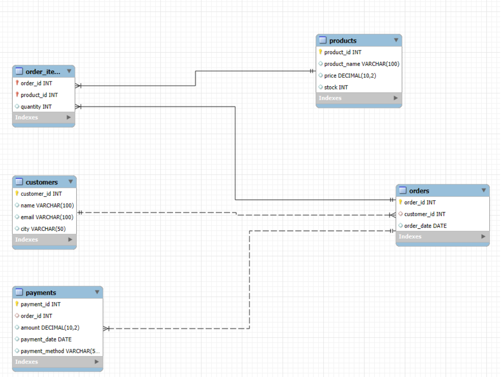

# 📦 Ecommerce Database Management System (SQL Project)

## 📝 Overview

This project presents a structured **Ecommerce Database Management System** built using **MySQL**. It demonstrates core concepts of relational database design and SQL query writing by simulating a real-world ecommerce environment.

The system includes management of:
- Customers
- Products
- Orders
- Order Items
- Payments

## 🗂️ Database Schema

Database Name: `EcommerceDB`

### 📋 ER Diagram



### 📋 Tables & Attributes

#### 1. `customers`
| Column       | Type         | Description        |
|--------------|--------------|--------------------|
| customer_id  | INT (PK)     | Unique customer ID |
| name         | VARCHAR(100) | Customer name      |
| email        | VARCHAR(100) | Customer email     |
| city         | VARCHAR(50)  | City of residence  |

#### 2. `products`
| Column       | Type           | Description          |
|--------------|----------------|----------------------|
| product_id   | INT (PK)       | Unique product ID    |
| product_name | VARCHAR(100)   | Name of the product  |
| price        | DECIMAL(10, 2) | Product price        |
| stock        | INT            | Available stock      |

#### 3. `orders`
| Column       | Type     | Description                     |
|--------------|----------|---------------------------------|
| order_id     | INT (PK) | Unique order ID                 |
| customer_id  | INT (FK) | Refers to `customers`           |
| order_date   | DATE     | Date the order was placed       |

#### 4. `order_items`
| Column     | Type         | Description                    |
|------------|--------------|--------------------------------|
| order_id   | INT (PK, FK) | Refers to `orders`             |
| product_id | INT (PK, FK) | Refers to `products`           |
| quantity   | INT          | Number of units ordered        |

#### 5. `payments`
| Column         | Type           | Description                        |
|----------------|----------------|------------------------------------|
| payment_id     | INT (PK)       | Unique payment ID                  |
| order_id       | INT (FK)       | Refers to `orders`                 |
| amount         | DECIMAL(10, 2) | Amount paid                        |
| payment_date   | DATE           | Date of payment                    |
| payment_method | VARCHAR(50)    | Mode of payment (UPI, Card, etc.)  |

## 📊 Sample Data

The database includes sample records:
- 👤 5 Customers  
- 📦 4 Products  
- 📑 5 Orders  
- 🛒 Order items for each order  
- 💳 Payments linked to each order

## 🔍 SQL Queries Implemented

### 1. Total Purchase by Each Customer

```sql
SELECT c.name AS Customer_Name, SUM(p.amount) AS Total_Purchase
FROM customers c
JOIN orders o ON c.customer_id = o.customer_id
JOIN payments p ON o.order_id = p.order_id
GROUP BY c.name;
```

### 2. Top-Selling Products

```sql
SELECT p.product_name, SUM(oi.quantity) AS Total_Quantity_Sold
FROM products p
JOIN order_items oi ON p.product_id = oi.product_id
GROUP BY p.product_name
ORDER BY Total_Quantity_Sold DESC;
```

### 3. Orders with Payments Greater Than ₹1000

```sql
SELECT o.order_id, c.name, pay.amount
FROM orders o
JOIN customers c ON o.customer_id = c.customer_id
JOIN payments pay ON o.order_id = pay.order_id
WHERE pay.amount > 1000;
```

### 4. Customers from a Specific City (e.g., Nellore)

```sql
SELECT * FROM customers WHERE city = 'Nellore';
```

## 🎯 Learning Objectives

* ✅ Practice normalization and table relationships  
* ✅ Implement SQL `JOIN`, `GROUP BY`, and `WHERE` clauses  
* ✅ Analyze real-world ecommerce data  
* ✅ Improve database design and documentation skills  

## 🛠️ Technologies Used

* **MySQL** (DBMS)  
* **MySQL Workbench** (ER modeling)  
* **PowerShell / Command Line** (for Git operations)  
* **Git** (Version control)  

## 📁 Project Files

* `EcommerceDB.sql` – SQL script with full schema and data insertion  
* `EcommerceDB ER.mwb` – MySQL Workbench ER diagram file  
* `README.md` – Project overview and documentation  
* `er_diagram.png` – ER diagram image used in this README  

## 👨‍💻 Author

**Tulasi Lakshmi Narashima Raya**  
📧 [tulasilakshminarashima@gmail.com](mailto:tulasilakshminarashima@gmail.com)

---

> 📌 *This project serves as a foundational example for understanding database design and performing key SQL operations in an ecommerce context.*
